# DES算法  

DES 是一种典型的块加密方法：它以64位为分组长度，64位一 组的明文作为算法的输入，通过一系列复杂的操作，输出同样 64位长度的密文。 DES 使用加密密钥定义变换过程，因此算法认为只有持有加密 所用的密钥的用户才能解密密文。DES 采用64位密钥，但由于每8位中的最后1位用于奇偶校验， 实际有效密钥长度为56位。密钥可以是任意的56位的数，且可 随时改变。其中极少量的数被认为是弱密钥，但能容易地避开 它们。所有的保密性依赖于密钥。DES 算法的基本过程是换位和置换。
## DES算法原理概述
### 加密过程  
* 公式：

$$C = E_k(M) = IP^{-1} · T_{16} · T_15 ·… · T_1 · IP(M) $$
* IP 为初始置换；IP-1 是IP 的逆置换；T1, T2 , …, T16 是一系列的迭代变换


<div align=center >

```flowchart
st=>start: 输入64位明文

e=>end: 输出64位密文
op1=>operation: 输入64位密码
op2=>operation: 初始置换IP
op3=>operation: 16轮迭代T1->T16
op4=>operation: 逆置换IP


st->op1->op2->op3->op4->e

```
</div>

* 16次迭代转换，需要使用密码生成的16个子密码，进行f 置换  

$$ L_i = R_{i-1} ,R_i = L_{i-1}\oplus f(R_{i-1},subkey_i),i=1...16 $$


### 解密过程

* 公式：

$$ M = D_k(C) = IP^{-1} · T_1 · T_2 · … · T_16 · IP (C) $$
*  IP 为初始置换；IP-1 是IP 的逆置换；T1, T2 , …, T16 是一系列的迭代变换

<div align=center>

```flowchart

st=>start: 输入密文
e=>end: 输出明文
op1=>operation: 输入64位密码
op2=>operation: 初始置换IP
op3=>operation: 16轮迭代T16->T1
op4=>operation: 逆置换IP

st->op1->op2->op3->op4->e


```
</div>

* 16次迭代转换，需要使用密码生成的16个子密码，进行f 置换  

$$ L_i = R_{i-1} ,R_i = L_{i-1}\oplus f(R_{i-1},subkey_{15-i}),i=1...16 $$


---


## 总体结构

### 加密过程


### 解密过程
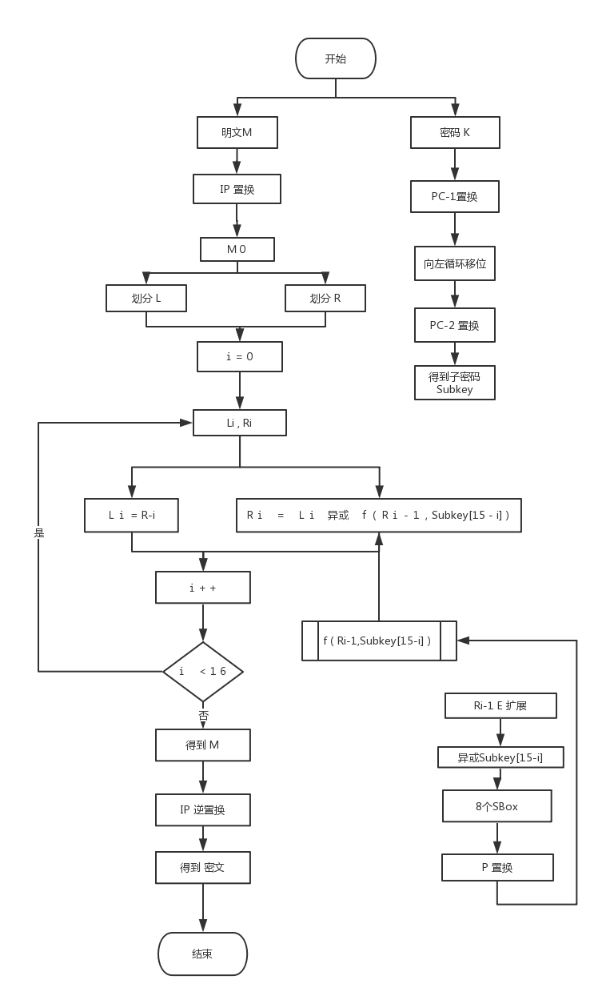


---

## 模块分解

### IP置换

通过IP置换表，将原数组置换。

输入64位，输入64位

```
int IP_TABLE[] = {
		58, 50, 42, 34, 26, 18, 10, 2,
		60, 52, 44, 36, 28, 20, 12, 4,
		62, 54, 46, 38, 30, 22, 14, 6,
		64, 56, 48, 40, 32, 24, 16, 8,
		57, 49, 41, 33, 25, 17, 9,  1,
		59, 51, 43, 35, 27, 19, 11, 3,
		61, 53, 45, 37, 29, 21, 13, 5,
		63, 55, 47, 39, 31, 23, 15, 7
		};

	for (int i = 0; i < 64; i++) {
		output[63-i] = src[64-IP_TABLE[i]];
	}

	return output;
```

### 迭代T

#### 加密T迭代

$$ L_i = R_{i-1} ,R_i = L_{i-1}\oplus f(R_{i-1},subkey_i),i=1...16 $$

```
for (int i = 0; i < 16; i++)
	{
		newLeftBits = rightBits;
		newRightBits = leftBits ^ f(rightBits, subkey[i]);
		leftBits = newLeftBits;
		rightBits = newRightBits;
	}
```

#### 解密T迭代

$$ L_i = R_{i-1} ,R_i = L_{i-1}\oplus f(R_{i-1},subkey_{15-i}),i=1...16 $$

```
for (int i = 0; i < 16; i++)
	{
		newLeftBits = rightBits;
		newRightBits = leftBits ^ f(rightBits, subkey[15-i]);
		leftBits = newLeftBits;
		rightBits = newRightBits;
	}
```

#### Feistel轮函数f(Ri-1, Ki)

##### E扩展

将长度为32位的串Ri-1 作E-扩展，成为48位的串E(Ri-1)； 

输入32位，输出48位

```
int E_TABLE[] = {
		32, 1, 2, 3, 4, 5,
		4, 5, 6, 7, 8, 9,
		8, 9, 10, 11, 12, 13,
		12, 13, 14, 15, 16, 17,
		16, 17, 18, 19, 20, 21,
		20, 21, 22, 23, 24, 25,
		24, 25, 26, 27, 28, 29,
		28, 29, 30, 31, 32, 1};

	for (int i = 0; i < 48; i++)
	{
		output[47 - i] = src[32 - E_TABLE[i]];
	}

	return output;
```

##### SBox转换

各个 分组分别经过8个不同的 S-盒进行 6-4 转换，得到8个长度分别 为4位的分组   

输入6位，输出4位

```
 int row = 0, col = 0;
	int box = 0;
	row = tem[0] * 2 + tem[5];
	col = tem[1] * 2 * 2 * 2 + tem[2] * 2 * 2 + tem[3] * 2 + tem[4];

	box = sbox[row * 16 + col];

	bitset<4> temp(box);
	bitset<4> output;
	for (int i = 0; i < 4; i++)
	{
		output[i] = temp[3 - i];
	}

	return output;
```

##### P置换


经过P-置换，得到的结果作为轮函数f(Ri-1, Ki) 的最 终32位输出。  

输入32位，输出32位

```
int P_TABLE[] = {
		16, 7, 20, 21,
		29, 12, 28, 17,
		1, 15, 23, 26,
		5, 18, 31, 10,
		2, 8, 24, 14,
		32, 27, 3, 9,
		19, 13, 30, 6,
		22, 11, 4, 25};

	for (int i = 0; i < 32; i++)
	{
		output[31 - i] = src[32 - P_TABLE[i]];
	}

	return output;
```

### IP逆置换

通过IP置换表，将原数组置换。
输入64位，输入64位

```
int IIP_TABLE[] = {
		40, 8, 48, 16, 56, 24, 64, 32,
		39, 7, 47, 15, 55, 23, 63, 31,
		38, 6, 46, 14, 54, 22, 62, 30,
		37, 5, 45, 13, 53, 21, 61, 29,
		36, 4, 44, 12, 52, 20, 60, 28,
		35, 3, 43, 11, 51, 19, 59, 27,
		34, 2, 42, 10, 50, 18, 58, 26,
		33, 1, 41,  9, 49, 17, 57, 25
	};

	for (int i = 0; i < 64; i++) {
		output[63 - i] = src[64 - IP_TABLE[i]];
	}

	return output;
```

### 子密钥

子密钥生成过程根据给定的64位密钥 K，生成16个48位的子密 钥 K1-K16，供 Feistel 轮函数 f(Ri-1, Ki) 调用


#### PC-1置换

对K 的56个非校验位实行置换PC-1，得到C0D0，其中C0 和D0 分别由PC-1 置换后的前28位和后28位组成。 

输入64位，输出56位

```
int PC1_TABLE[] = {
		57, 49, 41, 33, 25, 17, 9,
		1, 58, 50, 42, 34, 26, 18,
		10, 2, 59, 51, 43, 35, 27,
		19, 11, 3, 60, 52, 44, 36,
		63, 55, 47, 39, 31, 23, 15,
		7, 62, 54, 46, 38, 30, 22,
		14, 6, 61, 53, 45, 37, 29,
		21, 13, 5, 28, 20, 12, 4};

	for (int i = 0; i < 56; i++)
	{
		output[55 - i] = src[64 - PC1_TABLE[i]];
	}

	return output;
```

#### 左循环移位

计算Ci = LSi(Ci-1) 和Di = LSi(Di-1) ◌ 当i=1, 2, 9, 16 时，LSi(A) 表示将二进制串A 循环左移一个 位置；否则循环左移两个位置。 

输入56位，输出56位

```
int shift = 0;
	bitset<28> tem = temKey;
	if (r == 0 || r == 1 || r == 8 || r == 15)
	{
		shift = 1;
	}
	else
	{
		shift = 2;
	}
	for (int i = 27; i >= 0; i--)
	{
		if ((i - shift) < 0)
		{
			tem[i] = temKey[i - shift + 28];
		}
		else
		{
			tem[i] = temKey[i - shift];
		}
	}

	return tem;
```

#### PC-2置换

对56位的CiDi 实行PC-2 压缩置换，得到48位的Ki 

输入56位，输出48位

```
int PC2_TABLE[] = {
		14, 17, 11, 24, 1, 5,
		3, 28, 15, 6, 21, 10,
		23, 19, 12, 4, 26, 8,
		16, 7, 27, 20, 13, 2,
		41, 52, 31, 37, 47, 55,
		30, 40, 51, 45, 33, 48,
		44, 49, 39, 56, 34, 53,
		46, 42, 50, 36, 29, 32};

	for (int i = 0; i < 48; i++)
	{
		output[47 - i] = src[56 - PC2_TABLE[i]];
	}

	return output;
```

---

## 数据类型

* 明文：输入为8字节的字符串，DES过程为64位的数组
* 密码：输入为8字节的字符串，DES过程为64位的数组
* 密文：输入为8字节的字符串，DES过程为64位的数组，输出结果位8字节字符串


---

## 源代码

```c++
#include <iostream>
#include <string>
#include <bitset>

using namespace std;

bitset<48> subkey[16];

bitset<64> CharsToBitset(const char str[8]);
string BitsetToString(bitset<64> bits);
bitset<64> IP(bitset<64> &src);
bitset<64> InverseIP(bitset<64> &src);
bitset<56> PCOne(bitset<56> src);
bitset<48> PCTwo(bitset<56> src);
void Subkey(bitset<64> key);
bitset<28> leftShift(bitset<28> temKey, int r);
bitset<32> f(bitset<32> right, bitset<48> subkey);
bitset<48> Expend(bitset<32> src);
bitset<4> SBox(bitset<6> tem, int *sbox);
bitset<32> P(bitset<32> src);
void Decrypt(string &c);
void Encrypt(string &c);

bitset<64> CharsToBitset(const char str[8])
{
	bitset<64> bits;
	for (int i = 0; i < 8; i++)
	{
		for (int j = 0; j < 8; j++)
		{
			bits[i * 8 + j] = ((str[i] >> j) & 1);
		}
	}

	return bits;
}

string BitsetToString(bitset<64> bits)
{
	char ch[8];
	bitset<8> e[8];

	for (int i = 0; i < 8; i++)
	{
		e[0][i] = bits[i];
	}
	for (int i = 8; i < 16; i++)
	{
		e[1][i - 8] = bits[i];
	}
	for (int i = 16; i < 24; i++)
	{
		e[2][i - 16] = bits[i];
	}
	for (int i = 24; i < 32; i++)
	{
		e[3][i - 24] = bits[i];
	}
	for (int i = 32; i < 40; i++)
	{
		e[4][i - 32] = bits[i];
		;
	}
	for (int i = 40; i < 48; i++)
	{
		e[5][i - 40] = bits[i];
	}
	for (int i = 48; i < 56; i++)
	{
		e[6][i - 48] = bits[i];
	}
	for (int i = 56; i < 64; i++)
	{
		e[7][i - 56] = bits[i];
	}
	string s;

	for (int i = 0; i < 8; i++)
	{

		int l = e[i].to_ulong();
		ch[i] = (char)l;
		s = s + ch[i];
	}

	return s;
}

bitset<64> IP(bitset<64> &src)
{
	bitset<64> output;

	int IP_TABLE[] = {
		58, 50, 42, 34, 26, 18, 10, 2,
		60, 52, 44, 36, 28, 20, 12, 4,
		62, 54, 46, 38, 30, 22, 14, 6,
		64, 56, 48, 40, 32, 24, 16, 8,
		57, 49, 41, 33, 25, 17, 9, 1,
		59, 51, 43, 35, 27, 19, 11, 3,
		61, 53, 45, 37, 29, 21, 13, 5,
		63, 55, 47, 39, 31, 23, 15, 7};

	for (int i = 0; i < 64; i++)
	{
		output[63 - i] = src[64 - IP_TABLE[i]];
	}

	return output;
}

bitset<64> InverseIP(bitset<64> &src)
{
	bitset<64> output;

	int IIP_TABLE[] = {
		40, 8, 48, 16, 56, 24, 64, 32,
		39, 7, 47, 15, 55, 23, 63, 31,
		38, 6, 46, 14, 54, 22, 62, 30,
		37, 5, 45, 13, 53, 21, 61, 29,
		36, 4, 44, 12, 52, 20, 60, 28,
		35, 3, 43, 11, 51, 19, 59, 27,
		34, 2, 42, 10, 50, 18, 58, 26,
		33, 1, 41, 9, 49, 17, 57, 25};

	for (int i = 0; i < 64; i++)
	{
		output[63 - i] = src[64 - IIP_TABLE[i]];
	}

	return output;
}

bitset<56> PCOne(bitset<64> src)
{
	bitset<56> output;

	int PC1_TABLE[] = {
		57, 49, 41, 33, 25, 17, 9,
		1, 58, 50, 42, 34, 26, 18,
		10, 2, 59, 51, 43, 35, 27,
		19, 11, 3, 60, 52, 44, 36,
		63, 55, 47, 39, 31, 23, 15,
		7, 62, 54, 46, 38, 30, 22,
		14, 6, 61, 53, 45, 37, 29,
		21, 13, 5, 28, 20, 12, 4};

	for (int i = 0; i < 56; i++)
	{
		output[55 - i] = src[64 - PC1_TABLE[i]];
	}

	return output;
}
bitset<48> PCTwo(bitset<56> src)
{
	bitset<48> output;

	int PC2_TABLE[] = {
		14, 17, 11, 24, 1, 5,
		3, 28, 15, 6, 21, 10,
		23, 19, 12, 4, 26, 8,
		16, 7, 27, 20, 13, 2,
		41, 52, 31, 37, 47, 55,
		30, 40, 51, 45, 33, 48,
		44, 49, 39, 56, 34, 53,
		46, 42, 50, 36, 29, 32};

	for (int i = 0; i < 48; i++)
	{
		output[47 - i] = src[56 - PC2_TABLE[i]];
	}

	return output;
}

void Subkey(bitset<64> key)
{
	bitset<56> realKey;
	bitset<28> leftKey;
	bitset<28> rightKey;
	bitset<48> compressKey;

	//PC one
	realKey = PCOne(key);

	for (int r = 0; r < 16; r++)
	{
		for (int i = 28; i < 56; i++)
		{
			leftKey[i - 28] = realKey[i];
		}
		for (int i = 0; i < 28; i++)
		{
			rightKey[i] = realKey[i];
		}

		leftKey = leftShift(leftKey, r);
		rightKey = leftShift(rightKey, r);

		for (int i = 0; i < 28; i++)
		{
			realKey[i] = rightKey[i];
		}
		for (int i = 28; i < 56; i++)
		{
			realKey[i] = leftKey[i - 28];
		}

		//PC two
		compressKey = PCTwo(realKey);

		subkey[r] = compressKey;
	}
}

bitset<28> leftShift(bitset<28> temKey, int r)
{
	int shift = 0;
	bitset<28> tem = temKey;
	if (r == 0 || r == 1 || r == 8 || r == 15)
	{
		shift = 1;
	}
	else
	{
		shift = 2;
	}
	for (int i = 27; i >= 0; i--)
	{
		if ((i - shift) < 0)
		{
			tem[i] = temKey[i - shift + 28];
		}
		else
		{
			tem[i] = temKey[i - shift];
		}
	}

	return tem;
}

bitset<32> f(bitset<32> right, bitset<48> subkey)
{
	int SBox1[] = {
		14, 4, 13, 1, 2, 15, 11, 8, 3, 10, 6, 12, 5, 9, 0, 7,
		0, 15, 7, 4, 15, 2, 13, 1, 10, 6, 12, 11, 9, 5, 3, 8,
		4, 1, 14, 8, 13, 6, 2, 11, 15, 12, 9, 7, 3, 10, 5, 0,
		15, 12, 8, 2, 4, 9, 1, 7, 5, 11, 3, 14, 10, 0, 6, 13};

	int SBox2[] = {
		15, 1, 8, 14, 6, 11, 3, 4, 9, 7, 2, 13, 12, 0, 5, 10,
		3, 13, 4, 7, 15, 2, 8, 14, 12, 0, 1, 10, 6, 9, 11, 5,
		0, 14, 7, 11, 10, 4, 13, 1, 5, 8, 12, 6, 9, 3, 2, 15,
		13, 8, 10, 1, 3, 15, 4, 2, 11, 6, 7, 12, 0, 5, 14, 9};

	int SBox3[] = {
		10, 0, 9, 14, 6, 3, 15, 5, 1, 13, 12, 7, 11, 4, 2, 8,
		13, 7, 0, 9, 3, 4, 6, 10, 2, 8, 5, 14, 12, 11, 15, 1,
		13, 6, 4, 9, 8, 15, 3, 0, 11, 1, 2, 12, 5, 10, 14, 7,
		1, 10, 13, 0, 6, 9, 8, 7, 4, 15, 14, 3, 11, 5, 2, 12};

	int SBox4[] = {
		7, 13, 14, 3, 0, 6, 9, 10, 1, 2, 8, 5, 11, 12, 4, 15,
		12, 8, 11, 5, 6, 15, 0, 3, 4, 7, 2, 12, 1, 10, 14, 9,
		10, 6, 9, 0, 12, 11, 7, 13, 15, 1, 3, 14, 5, 2, 8, 4,
		3, 15, 0, 6, 10, 1, 13, 8, 9, 4, 5, 11, 12, 7, 2, 14};

	int SBox5[] = {
		2, 12, 4, 1, 7, 10, 11, 6, 8, 5, 3, 15, 13, 0, 14, 9,
		14, 11, 2, 12, 4, 7, 13, 1, 5, 0, 15, 10, 3, 9, 8, 6,
		4, 2, 1, 11, 10, 13, 7, 8, 15, 9, 12, 5, 6, 3, 0, 14,
		11, 8, 12, 7, 1, 14, 2, 13, 6, 15, 0, 9, 10, 4, 5, 3};

	int SBox6[] = {
		12, 1, 10, 15, 9, 2, 6, 8, 0, 13, 3, 4, 14, 7, 5, 11,
		10, 15, 4, 2, 7, 12, 9, 5, 6, 1, 13, 14, 0, 11, 3, 8,
		9, 14, 15, 5, 2, 8, 12, 3, 7, 0, 4, 10, 1, 13, 11, 6,
		4, 3, 2, 12, 9, 5, 15, 10, 11, 14, 1, 7, 6, 0, 8, 13

	};

	int SBox7[] = {
		4, 11, 2, 14, 15, 0, 8, 13, 3, 12, 9, 7, 5, 10, 6, 1,
		13, 0, 11, 7, 4, 9, 1, 10, 14, 3, 5, 12, 2, 15, 8, 6,
		1, 4, 11, 13, 12, 3, 7, 14, 10, 15, 6, 8, 0, 5, 9, 2,
		6, 11, 13, 8, 1, 4, 10, 7, 9, 5, 0, 15, 14, 2, 3, 12};

	int SBox8[] = {
		13, 2, 8, 4, 6, 15, 11, 1, 10, 9, 3, 14, 5, 0, 12, 7,
		1, 15, 13, 8, 10, 3, 7, 4, 12, 5, 6, 11, 0, 14, 9, 2,
		7, 11, 4, 1, 9, 12, 14, 2, 0, 6, 10, 13, 15, 3, 5, 8,
		2, 1, 14, 7, 4, 10, 8, 13, 15, 12, 9, 0, 3, 5, 6, 11};

	bitset<48> rightExpend;
	bitset<6> e1, e2, e3, e4, e5, e6, e7, e8;
	bitset<4> sbox1, sbox2, sbox3, sbox4, sbox5, sbox6, sbox7, sbox8;
	//Extend
	rightExpend = Expend(right);

	rightExpend = rightExpend ^ subkey;

	for (int i = 0; i < 6; i++)
	{
		e1[i] = rightExpend[47 - 0 - i];
		e2[i] = rightExpend[47 - 6 - i];
		e3[i] = rightExpend[47 - 12 - i];
		e4[i] = rightExpend[47 - 18 - i];
		e5[i] = rightExpend[47 - 24 - i];
		e6[i] = rightExpend[47 - 30 - i];
		e7[i] = rightExpend[47 - 36 - i];
		e8[i] = rightExpend[47 - 42 - i];
	}

	sbox1 = SBox(e1, SBox1);
	sbox2 = SBox(e2, SBox2);
	sbox3 = SBox(e3, SBox3);
	sbox4 = SBox(e4, SBox4);
	sbox5 = SBox(e5, SBox5);
	sbox6 = SBox(e6, SBox6);
	sbox7 = SBox(e7, SBox7);
	sbox8 = SBox(e8, SBox8);

	bitset<32> result;

	for (int i = 0; i < 4; i++)
	{
		result[i + 0] = sbox1[i];
		result[i + 4] = sbox2[i];
		result[i + 8] = sbox3[i];
		result[i + 12] = sbox4[i];
		result[i + 16] = sbox5[i];
		result[i + 20] = sbox6[i];
		result[i + 24] = sbox7[i];
		result[i + 28] = sbox8[i];
	}

	bitset<32> temp = result;
	for (int i = 0; i < 32; i++)
	{
		result[i] = temp[31 - i];
	}

	//P
	result = P(result);
	return result;
}

bitset<48> Expend(bitset<32> src)
{

	bitset<48> output;

	int E_TABLE[] = {
		32, 1, 2, 3, 4, 5,
		4, 5, 6, 7, 8, 9,
		8, 9, 10, 11, 12, 13,
		12, 13, 14, 15, 16, 17,
		16, 17, 18, 19, 20, 21,
		20, 21, 22, 23, 24, 25,
		24, 25, 26, 27, 28, 29,
		28, 29, 30, 31, 32, 1};

	for (int i = 0; i < 48; i++)
	{
		output[47 - i] = src[32 - E_TABLE[i]];
	}

	return output;
}

bitset<4> SBox(bitset<6> tem, int *sbox)
{

	int row = 0, col = 0;
	int box = 0;
	row = tem[0] * 2 + tem[5];
	col = tem[1] * 2 * 2 * 2 + tem[2] * 2 * 2 + tem[3] * 2 + tem[4];

	box = sbox[row * 16 + col];

	bitset<4> temp(box);
	bitset<4> output;
	for (int i = 0; i < 4; i++)
	{
		output[i] = temp[3 - i];
	}

	return output;
}

bitset<32> P(bitset<32> src)
{
	bitset<32> output;

	int P_TABLE[] = {
		16, 7, 20, 21,
		29, 12, 28, 17,
		1, 15, 23, 26,
		5, 18, 31, 10,
		2, 8, 24, 14,
		32, 27, 3, 9,
		19, 13, 30, 6,
		22, 11, 4, 25};

	for (int i = 0; i < 32; i++)
	{
		output[31 - i] = src[32 - P_TABLE[i]];
	}

	return output;
}

//DES 解密
void Decrypt(string &c)
{
	string text = c;
	string key;

	cout << "Input password:(8 char)" << endl;
	cin >> key;
	while (key.length() != 8)
	{
		cout << "Input error( need 8 char )" << endl;
		cout << "Input password:(8 char)" << endl;
		cin >> key;
	}

	bitset<64> textBits;
	bitset<64> keyBits;
	bitset<32> leftBits;
	bitset<32> rightBits;
	bitset<32> newLeftBits;
	bitset<32> newRightBits;
	bitset<64> cipher;
	bitset<64> tem;

	textBits = CharsToBitset(c.c_str());
	keyBits = CharsToBitset(key.c_str());
	Subkey(keyBits);
	cout << "ciph" << textBits.to_string() << endl;
	cout << "pass" << keyBits.to_string() << endl;
	tem = textBits;
	textBits = IP(tem); //IP 置换

	for (int i = 32; i < 64; i++)
	{
		leftBits[i - 32] = textBits[i];
	}
	for (int i = 0; i < 32; i++)
	{
		rightBits[i] = textBits[i];
	}

	//16次迭代
	for (int i = 0; i < 16; i++)
	{
		newLeftBits = rightBits;
		newRightBits = leftBits ^ f(rightBits, subkey[15 - i]);
		leftBits = newLeftBits;
		rightBits = newRightBits;
	}

	//W 置换
	for (int i = 0; i < 32; i++)
	{
		tem[i] = leftBits[i];
	}
	for (int i = 32; i < 64; i++)
	{
		tem[i] = rightBits[i - 32];
	}

	//IP 逆置换
	cipher = InverseIP(tem);
	c = cipher.to_string();
	cout << "text" << c << endl;
	c = BitsetToString(cipher);
	cout << "text" << c << endl;
}

//DES 加密
void Encrypt(string &c)
{
	string text;
	string key;
	cout << "Input text:(8 char)" << endl;
	cin >> text;
	cout << "Input password:(8 char)" << endl;
	cin >> key;
	while (text.length() != 8 || key.length() != 8)
	{
		cout << "Input error( need 8 char )" << endl;
		cout << "Input text:(8 char)" << endl;
		cin >> text;
		cout << "Input password:(8 char)" << endl;
		cin >> key;
	}

	bitset<64> textBits;
	bitset<64> keyBits;
	bitset<32> leftBits;
	bitset<32> rightBits;
	bitset<32> newLeftBits;
	bitset<32> newRightBits;
	bitset<64> cipher;
	bitset<64> tem;

	textBits = CharsToBitset(text.c_str());
	keyBits = CharsToBitset(key.c_str());
	Subkey(keyBits);

	cout << "text" << textBits.to_string() << endl;
	cout << "pass" << keyBits.to_string() << endl;
	tem = textBits;
	textBits = IP(tem); //IP 置换
	for (int i = 32; i < 64; i++)
	{
		leftBits[i - 32] = textBits[i];
	}
	for (int i = 0; i < 32; i++)
	{
		rightBits[i] = textBits[i];
	}

	//16次迭代
	for (int i = 0; i < 16; i++)
	{
		newLeftBits = rightBits;
		newRightBits = leftBits ^ f(rightBits, subkey[i]);
		leftBits = newLeftBits;
		rightBits = newRightBits;
	}

	//W 置换
	for (int i = 0; i < 32; i++)
	{
		tem[i] = leftBits[i];
	}
	for (int i = 32; i < 64; i++)
	{
		tem[i] = rightBits[i - 32];
	}

	//IP 逆置换
	cipher = InverseIP(tem);

	c = cipher.to_string();
	cout << "ciph" << c << endl;
	c = BitsetToString(cipher);
}

int main()
{

	string cipher;
	Encrypt(cipher);

	Decrypt(cipher);
	getchar();
	system("pause");
	return 0;
}
```

---

## 编译运行结果

### 成功加密，解密密码正确
* 输入明文字符串
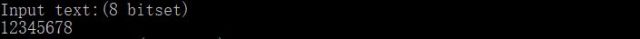
* 输入密码字符串
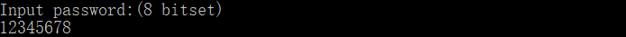
* 输出二进制明文
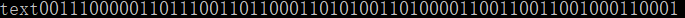
* 输出二进制密码
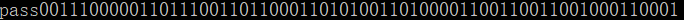
* 输入密码字符串
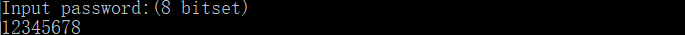
* 输出二进制密文
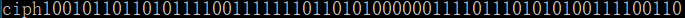
* 输出二进制密码
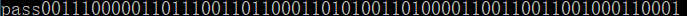

* 输出解密后二进制
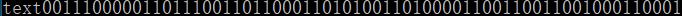

* 输出解密后字符串
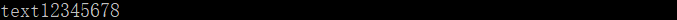


### 成功加密，解密密码错误
* 输入明文字符串

* 输入密码字符串

* 输出二进制明文

* 输出二进制密码

* 输入密码字符串
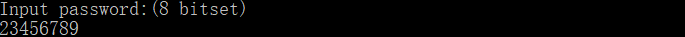
* 输出二进制密文
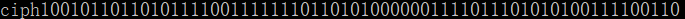
* 输出二进制密码
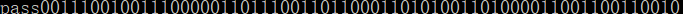

* 输出解密后二进制
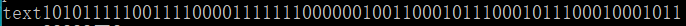

* 输出解密后字符串
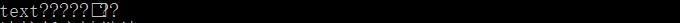


---

## 实验中遇到的问题及解决方法

本次实现DES密码体系，总的过程不算艰难，就是对于某些转换过程有的时候会有些迷糊，导致第一次编译时出现了错误，解密过程出现了解密后的结果和输入的密文完全一致的情况，就有点摸不着头脑。之后在调试期间对照老师的PPT重新校对了几个转换。这次的实验加深了我对DES的理解，对其中的各个模块的功能更加了解。

---


